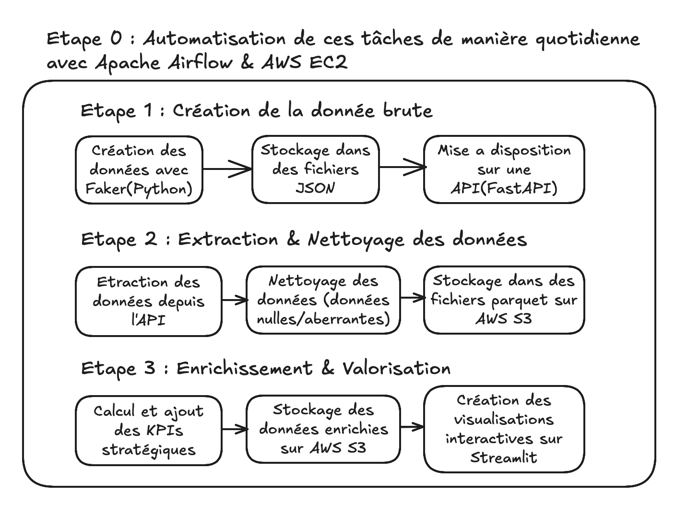
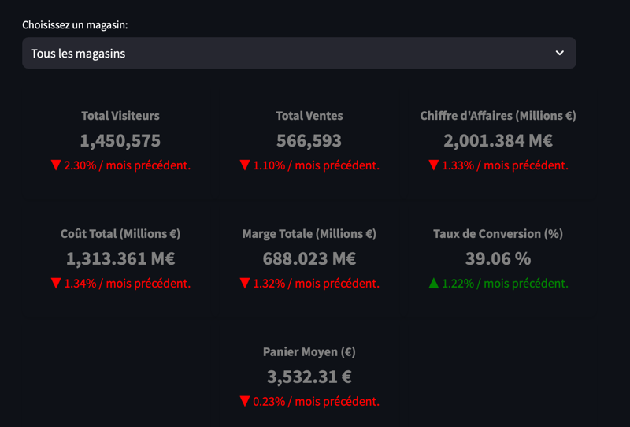
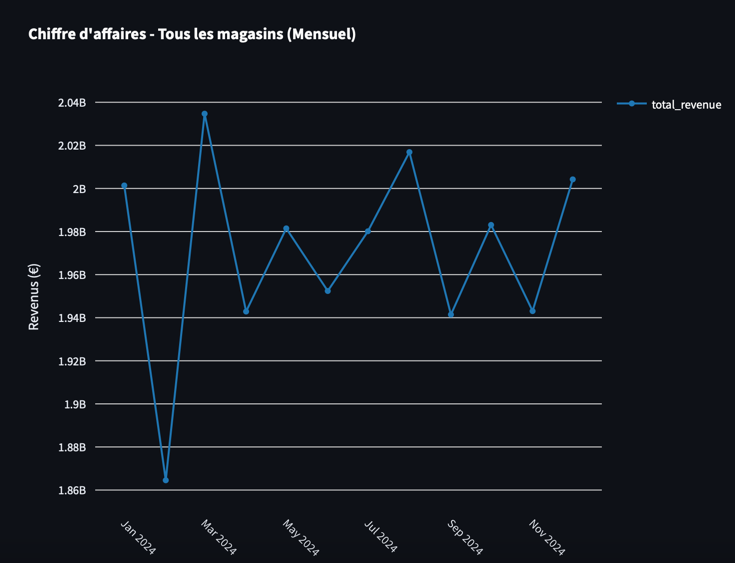
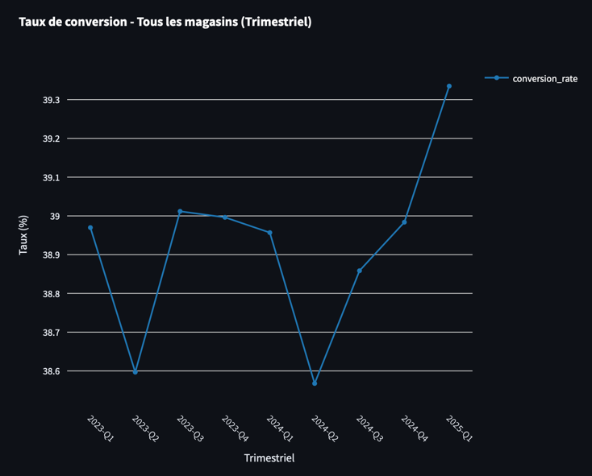

# RetailInsights-Simulator
 
Découvrez le projet ici : [Lien vers l'application](http://3.228.168.7:8501) *(Disponible uniquement de 8h à 19h pour optimiser les coûts).*

# Table des Matières
1. [Introduction](#introduction)
2. [Architecture du Projet](#architecture-du-projet)
    - [Points Forts de l’Architecture](#points-forts-de-larchitecture)
3. [Pipeline ETL](#pipeline-etl)
    - [Étape 1 : Génération des Données](#étape-1--génération-des-données)
    - [Étape 2 : Extraction des Données](#étape-2--extraction-des-données)
    - [Étape 3 : Transformation des Données](#étape-3--transformation-des-données)
    - [Étape 4 : Stockage Cloud](#étape-4--stockage-cloud)
    - [Étape 5 : Visualisation](#étape-5--visualisation)
    - [Orchestration avec Apache Airflow](#orchestration-avec-apache-airflow)
4. [Technologies Utilisées](#technologies-utilisées)
    - [Apache Airflow (Orchestration)](#1-apache-airflow-orchestration)
    - [Python (Génération, Extraction et Transformation)](#2-python-génération-extraction-et-transformation)
    - [Amazon S3 (Stockage Cloud)](#3-amazon-s3-stockage-cloud)
    - [Streamlit (Visualisation)](#4-streamlit-visualisation)
    - [GitHub Actions (CI/CD)](#5-github-actions-cicd)
    - [AWS EC2 (Hébergement)](#6-aws-ec2-hébergement)
    - [Pytest (Tests Unitaires)](#7-pytest-tests-unitaires)
    - [FastAPI (API de Manipulation des Données)](#8-fastapi-api-de-manipulation-des-données)
5. [Résultats et Visualisation](#résultats-et-visualisation)
    - [Indicateurs Clés de Performance (KPI)](#1-indicateurs-clés-de-performance-kpi)
    - [Graphiques Interactifs](#2-graphiques-interactifs)
    - [Exemple de Visualisation](#3-exemple-de-visualisation)
    - [Fonctionnalités de l’Application Streamlit](#4-fonctionnalités-de-lapplication-streamlit)
6. [CI/CD et Déploiement](#cicd-et-déploiement)
    - [Pipeline CI/CD avec GitHub Actions](#1-pipeline-cicd-avec-github-actions)
    - [Déploiement sur AWS EC2](#2-déploiement-sur-aws-ec2)
7. [Logs et Monitoring](#logs-et-monitoring)
    - [Structure](#1-structure-des-logs)
    - [Exemple](#2-exemple-de-log)
    - [Utilisation](#3-utilisation-des-logs)
    - [Points Forts](#4-points-forts)
8. [Installation et Exécution](#configuration-et-installation)
    - [Prérequis](#prérequis)
    - [Installation](#étapes-dinstallation)
    - [Démarrage des services locaux](#démarrage-des-services-locaux)
    - [Déploiement sur AWS](#déploiement-sur-aws)
9. [Tests et Validation](#tests-et-validation)
    - [Organisation des Tests](#organisation-des-tests)
    - [Exécution des Tests](#exécution-des-tests)
    - [Points Clés des Tests](#points-clés-des-tests)
10. [Conclusion](#conclusion)


---

## Introduction

**RetailInsights-Simulator** est un projet conçu pour simuler et analyser les données d'un environnement retail. L'objectif est de démontrer comment transformer des données brutes en insights exploitables grâce à un pipeline ETL complet, automatisé et scalable.

Ce projet s'inscrit dans un contexte professionnel en mettant en avant des compétences clés en ingénierie des données, telles que :
- **Orchestration et automatisation des workflows** : Automatisation de bout en bout avec Apache Airflow.
- **Traitement des données dans le cloud** : Utilisation d'Amazon S3 pour un stockage optimisé.
- **Visualisation interactive** : Streamlit pour afficher des indicateurs clés de performance (KPI) et des graphiques interactifs.

**Consultez l'application Streamlit** : [RetailInsights-Simulator](http://3.228.168.7:8501) *(Disponible uniquement de 8h à 19h pour optimiser les coûts).*

L'objectif principal est de fournir un exemple concret d'une architecture data engineering moderne, capable de gérer des pipelines complexes et d'offrir des insights exploitables pour des prises de décision stratégiques.

---

## Architecture du Projet

Le projet **RetailInsights-Simulator** repose sur une architecture claire et modulaire, conçue pour transformer des données brutes en insights exploitables. L’objectif est d’illustrer l’intégration de technologies modernes pour automatiser un pipeline de données complet. <br>Voici un aperçu des composants principaux et leurs interactions :
<br><br><br>
1. **Orchestration du Pipeline (Apache Airflow)** :
   - Airflow orchestre toutes les étapes du pipeline, de la génération des données jusqu’à leur visualisation, grâce à des DAG (Directed Acyclic Graphs).
   - Le serveur Airflow est déployé sur une instance AWS EC2.
   - **Optimisation des coûts** : L'instance EC2 est active seulement 25 minutes par jour pour exécuter les workflows. Une fois le pipeline terminé, elle est arrêtée automatiquement via AWS EventBridge et Lambda.

2. **Génération et Stockage Initial (Local Storage)** :
   - Les données synthétiques (ventes, clients, produits, magasins) sont générées localement au format JSON, puis exposées via une API construite avec FastAPI. Cette API permet d'accéder et de manipuler les données générées, facilitant l'extraction et la consommation par les autres étapes du pipeline.
   - Cette étape simule un environnement retail réel, en recréant des données brutes nécessaires pour le pipeline.

3. **Stockage Cloud (Amazon S3)** :
   - Les fichiers JSON sont transformés au format Parquet, optimisant le stockage et la vitesse de lecture.
   - Ces fichiers Parquet sont stockés sur Amazon S3, garantissant une solution durable, sécurisée et scalable.

4. **Transformation des Données** :
   - Les données stockées sur S3 subissent un nettoyage et des transformations pour consolider et préparer les datasets finaux nécessaires à la visualisation.

5. **Visualisation Interactive (Streamlit)** :
   - Streamlit consomme les données transformées stockées sur S3 pour afficher des KPI et des graphiques interactifs.
   - Les visualisations fournissent une vue d’ensemble des performances retail, avec des métriques comme le chiffre d’affaires et la marge brute.
   - **Optimisation des coûts** : L’instance EC2 hébergeant Streamlit est active uniquement de 8h à 19h, grâce à AWS EventBridge et Lambda.

6. **CI/CD et Déploiement (AWS EC2 et GitHub Actions)** :
   - Un serveur EC2 héberge l’application Streamlit et le serveur Airflow.
   - Le déploiement et la maintenance sont automatisés via un pipeline CI/CD utilisant GitHub Actions.
   - Les frais sont réduits grâce à une gestion automatique des instances EC2 via AWS EventBridge et Lambda.

---

### Points Forts de l’Architecture
- **Efficacité** : Le stockage au format Parquet optimise les performances de lecture et de visualisation.
- **Flexibilité** : Le pipeline est conçu pour être extensible à d'autres sources de données ou cas d'usage.
- **Optimisation des coûts** : Les instances EC2 (Airflow et Streamlit) sont configurées pour fonctionner uniquement pendant les périodes nécessaires, réduisant les frais liés à AWS.

---

## Pipeline ETL

Le pipeline ETL de **RetailInsights-Simulator** est entièrement automatisé avec Apache Airflow. Il transforme des données brutes en insights exploitables en passant par les étapes suivantes :

### Étape 1 : Génération des Données
- **Description** : Création de données synthétiques représentant les ventes, les clients, les produits, les magasins, et les données retail.
- **Formats de sortie** : JSON.
- **Fichiers associés** :
  - `src/api/client_generator.py`
  - `src/api/product_generator.py`
  - `src/api/store_generator.py`
  - `src/api/retail_data_generator.py`
  - `src/api/sale_generator.py`

---

### Étape 2 : Extraction des Données
- **Description** : Extraction des données depuis l'API (alimentée par les fichiers JSON générés) et transformation au format Parquet avant leur stockage dans Amazon S3.
- **Formats de sortie** : Parquet.
- **Fichiers associés** :
  - `src/data_processing/extract/extract_clients.py`
  - `src/data_processing/extract/extract_products.py`
  - `src/data_processing/extract/extract_sales.py`
  - `src/data_processing/extract/extract_stores.py`
  - `src/data_processing/extract/extract_retail_data.py`
  - `src/data_processing/extract/utils.py`
  - `src/api/main.py`
  - `src/api/routes/*`

---

### Étape 3 : Transformation des Données
- **Description** : Consolidation des données pour préparer les datasets finaux. Calcul des métriques comme le chiffre d’affaires, la marge brute, et les variations hebdomadaires.
- **Formats de sortie** : Parquet.
- **Fichiers associés** :
  - `src/data_processing/transform/aggregate_daily_metrics.py`

---

### Étape 4 : Stockage Cloud
- **Description** : Stockage des données transformées sur Amazon S3 au format Parquet pour un accès rapide et sécurisé.
- **Outils utilisés** :
  - Amazon S3 (Bucket : `retail-insights-bucket`).

---

### Étape 5 : Visualisation
- **Description** : Affichage des données transformées sous forme de graphiques interactifs et de KPI via Streamlit.
- **Fichiers associés** :
  - `src/streamlit_app/app_stores.py`

---

### Orchestration avec Apache Airflow
- **Description** : Airflow orchestre chaque étape du pipeline via un DAG dédié. Il gère l’ordre d’exécution, les dépendances, et les erreurs.
- **Fichiers associés** :
  - `src/airflow/full_pipeline_retail_insights.py`

---

## Technologies Utilisées

Le projet **RetailInsights-Simulator** s’appuie sur un ensemble d’outils modernes pour démontrer les meilleures pratiques en ingénierie des données. Voici les principales technologies utilisées :

### 1. **Apache Airflow** (Orchestration)
- **Rôle** : Orchestration complète du pipeline ETL via des DAGs.
- **Caractéristique clé** : Gestion des dépendances et des workflows complexes.
- **Fichier clé** : `src/airflow/full_pipeline_retail_insights.py`

---

### 2. **Python** (Génération, Extraction et Transformation)
- **Rôle** : Langage principal pour la génération des données synthétiques, les transformations, et les tests.
- **Bibliothèques utilisées** :
  - **Pandas** : Manipulation et transformation des données.
  - **PyArrow** : Conversion des données au format Parquet.
  - **Faker** : Génération de données synthétiques réalistes.
- **Fichiers associés** :
  - Génération : `src/api/*_generator.py`
  - Extraction : `src/data_processing/extract/*`
  - Transformation : `src/data_processing/transform/*`

---

### 3. **Amazon S3** (Stockage Cloud)
- **Rôle** : Stockage des fichiers Parquet pour une scalabilité et un accès rapide.
- **Caractéristique clé** : Intégration avec Python via boto3.
- **Fichier clé** : `src/data_processing/extract/utils.py`

---

### 4. **Streamlit** (Visualisation)
- **Rôle** : Plateforme interactive pour afficher les KPI et les graphiques.
- **Caractéristique clé** : Rapide à déployer et accessible via une interface web conviviale.
- **Fichiers associés** :
  - `src/streamlit_app/app_stores.py`

---

### 5. **GitHub Actions** (CI/CD)
- **Rôle** : Automatisation des tests, de la qualité du code, et du déploiement.
- **Caractéristique clé** : Déclenchement automatique pour chaque modification du code.
- **Fichier clé** : `.github/workflows/cicd.yaml`

---

### 6. **AWS EC2** (Hébergement)
- **Rôle** : Hébergement des applications Streamlit et Airflow.
- **Optimisation des coûts** :
  - Instances configurées pour démarrer et s’arrêter automatiquement via AWS EventBridge et Lambda.

---

### 7. **Pytest** (Tests Unitaires)
- **Rôle** : Validation de chaque étape du pipeline ETL et des composants.
- **Caractéristique clé** : Intégration avec GitHub Actions pour garantir une qualité constante du code.
- **Fichiers associés** :
  - `tests/*`

---

### 8. **FastAPI** (API de Manipulation des Données)
- **Rôle** : Fournir une interface pour accéder aux données générées (clients, produits, magasins, ventes, retail_data).
- **Caractéristique clé** : Routes légères et performantes pour l'extraction des données.
- **Fichiers associés** :
  - `src/api/main.py`
  - `src/api/routes/*`

---

## Résultats et Visualisation

L’application **Streamlit** affiche des métriques clés et des graphiques interactifs pour analyser les performances retail. Ces résultats sont construits à partir des données transformées stockées sur Amazon S3.

### 1. **Indicateurs Clés de Performance (KPI)**
Voici les principaux KPI calculés et affichés :
- **Total des visiteurs** : Nombre total de visiteurs pour une période donnée.
- **Total des ventes** : Nombre total de transactions enregistrées.
- **Chiffre d’affaires (CA)** : Montant total des ventes (en euros).
- **Marge totale** : Différence entre le CA et le coût total.
- **Taux de conversion** : Pourcentage des visiteurs ayant réalisé un achat.
- **Panier moyen** : Montant moyen dépensé par transaction.

Ces indicateurs permettent d’évaluer l’efficacité des magasins et de suivre leur évolution dans le temps.

---

### 2. **Graphiques Interactifs**
Des graphiques interactifs permettent d'explorer les données sous différents angles :
- **Performance des ventes** : Analyse du volume des transactions au fil du temps (par jour, mois, trimestre ou année).
- **Performance des visiteurs** : Suivi de l'évolution du nombre de visiteurs sur les différentes périodes.
- **Quantités vendues** : Suivi des volumes de produits vendus sur les périodes sélectionnées.
- **Revenus et marges** : Analyse du chiffre d'affaires, des marges et des coûts associés.
- **Efficacité des ventes** : Indicateurs comme le taux de conversion et le panier moyen.

Ces visualisations sont générées avec **Plotly**, offrant une expérience utilisateur fluide et interactive.

---

### 3. **Exemple de Visualisation**
Voici un exemple des KPIs disponibles dans l’application :<br>
<br><br>
Voici des exemples de graphiques disponibles dans l’application :
- **Chiffre d'affaires par mois sur une année** : Montre les variations des revenus mensuels.<br>
<br><br>

- **Taux de conversion (%)** : Suivi de l’efficacité des magasins dans la conversion des visiteurs en acheteurs.<br>


---

### 4. **Fonctionnalités de l’Application Streamlit**
- **Filtres avancés** :
  - Par période (quotidien, mensuel, trimestriel, annuel).
  - Par magasin (tous les magasins ou un magasin spécifique).
- **Téléchargement des données** :
  - Possibilité de télécharger les données filtrées au format CSV pour une analyse approfondie.
- **Accès en temps réel** :
  - Les données sont mises à jour automatiquement après chaque exécution du pipeline ETL.

---

## CI/CD et Déploiement

Le projet **RetailInsights-Simulator** utilise un pipeline CI/CD robuste pour garantir une livraison rapide, fiable, et automatisée des fonctionnalités.

### 1. **Pipeline CI/CD avec GitHub Actions**
- **Rôle** : Automatisation des tests, de la qualité du code, et du déploiement.
- **Étapes du pipeline** :
  1. **Vérification du code** :
     - Analyse statique avec `flake8` pour garantir la qualité du code.
  2. **Exécution des tests unitaires** :
     - Tests asynchrones et synchrones avec `pytest` pour valider chaque composant du pipeline.
  3. **Déploiement** :
     - Déploiement de l'application Streamlit sur une instance AWS EC2.
  4. **Redémarrage des services** :
     - Redémarrage de l'instance EC2 pour garantir la prise en compte des dernières modifications.

- **Configuration** : Le pipeline est défini dans le fichier `.github/workflows/cicd.yaml`.

---

### 2. **Déploiement sur AWS EC2**
- **Rôle** : Hébergement des applications Airflow et Streamlit.
- **Optimisation des coûts** :
  - L'instance EC2 utilisée pour Airflow est configurée pour fonctionner uniquement pendant les périodes de traitement (25 minutes par jour).
  - L'instance EC2 hébergeant Streamlit est active uniquement de 8h à 19h, réduisant significativement les frais.
- **Automatisation** :
  - Les démarrages et arrêts des instances EC2 sont gérés via **AWS EventBridge** et **AWS Lambda**.

---

### Fichiers Associés
- **Pipeline CI/CD** : `.github/workflows/cicd.yaml`
- **Tests Unitaires** : `src/tests/*`
- **Scripts liés au déploiement** :
  - `src/airflow/full_pipeline_retail_insights.py` (orchestration du pipeline)
  - `src/streamlit_app/app_stores.py` (visualisation des résultats)

---

## Logs et Monitoring

Le projet **RetailInsights-Simulator** intègre un système de journalisation complet pour suivre les activités de chaque composant du pipeline ETL, de l'API et de l’application Streamlit.

### 1. **Structure des Logs**
Les logs sont organisés par composant pour une traçabilité maximale :
- **Génération des données** :
  - `src/logs/generation.log` : Suivi des opérations de génération des fichiers JSON pour les clients, produits, magasins, etc.
- **API (FastAPI)** :
  - `src/logs/api_access.log` : Journalise les appels aux différentes routes de l'API.
- **Extraction des données** :
  - `src/logs/extract_data.log` : Enregistre les activités d’extraction des données depuis l’API et leur sauvegarde dans S3.
- **Transformation des données** :
  - `src/logs/transform_data.log` : Suit les étapes de transformation et d’agrégation des données stockées dans S3.
- **Airflow** :
  - `src/logs/airflow_pipeline.log` : Logs des tâches orchestrées par Apache Airflow.
- **Application Streamlit** :
  - `src/logs/user_activity.log` : Journalise les interactions des utilisateurs avec l’interface Streamlit.

---

### 2. **Exemple de Log**
Voici un exemple de log pour la génération des clients :
```plaintext
2025-01-14 12:45:01 - INFO - Starting client generation for 20000 clients.
2025-01-14 12:45:15 - WARNING - Unrealistic age generated: 350
2025-01-14 12:45:20 - INFO - Successfully generated 20000 clients.
```

---

### 3. **Utilisation des Logs**
- **Débogage** :
  - Les logs de l'API permettent de vérifier les requêtes entrantes et les erreurs côté serveur.
  - Les logs des pipelines facilitent l’identification des erreurs à chaque étape.
- **Suivi des performances** :
  - Analyse des temps d'exécution pour chaque tâche et chaque route API.
- **Audit et traçabilité** :
  - Les logs permettent de vérifier les données traitées pour une date, une ville ou un magasin spécifique.

---

### 4. **Points Forts**
- **Centralisation des logs** : Chaque composant (API, génération, extraction, transformation) possède ses propres fichiers de logs.
- **Compatibilité avec des outils de monitoring avancés** : Les logs peuvent être intégrés dans des outils comme Amazon `CloudWatch` ou `Elasticsearch`.

---

### Fichiers Associés
- `src/logs/` : Répertoire contenant tous les fichiers de logs.
- `src/airflow/logger_airflow.py` : Configuration des logs pour Airflow.
- `src/api/routes/logger_routes.py` : Configuration des logs pour l'API (FastAPI).
- `src/data_processing/extract/logger_extraction.py` : Configuration des logs pour l’extraction.
- `src/data_processing/transform/logger_transformation.py` : Configuration des logs pour la transformation.
- `src/streamlit_app/logger_streamlit.py` : Configuration des logs pour Streamlit.

---

# Configuration et Installation

Pour exécuter **RetailInsights-Simulator**, une configuration minimale est nécessaire. Voici les étapes pour configurer, installer et démarrer le projet.

---

## Prérequis

1. **Environnement Python** :
   - Python version `3.10` ou supérieure.
   - Un environnement virtuel est recommandé (par exemple : `venv`).

2. **Services AWS** :
   - **S3** : Un bucket S3 configuré pour stocker les fichiers Parquet.
   - **EC2** : Instances pour héberger les workflows Airflow et l’application Streamlit.
   - **Lambda** : Créer des fonctions (par exemple : arrêter une instance EC2).  
   - **EventBridge** : Paramétrer des actions planifiées (arrêt/démarrage d'instances EC2).

3. **Autorisations API** :
   - L’API doit être accessible localement ou déployée sur un serveur pour permettre l’extraction des données.

---

## Étapes d'Installation

### 1. **Cloner le Dépôt**
Clonez le projet depuis le dépôt GitHub :
```bash
git clone git@github.com:Mohamed-El-Madiouni/RetailInsights-Simulator.git
cd RetailInsights-Simulator
```

### 2. **Configurer l’Environnement**
Créez un fichier `.env` dans la racine du projet pour configurer les clés AWS :
```bash
AWS_ACCESS_KEY_ID = votre_cle_d_access
AWS_SECRET_ACCESS_KEY = votre_cle_secret
AWS_REGION = votre_region
```

### 3. **Installer les Dépendances**
Activez votre environnement virtuel et installez les dépendances :
```bash
python -m venv venv
source venv/bin/activate  # Pour Linux/Mac
venv\Scripts\activate     # Pour Windows

pip install -r requirements.txt
```

---

## Démarrage des Services Locaux

### 1. **Démarrer l’API**
Lancez l’API localement avec Uvicorn :
```bash
python src/api/main.py
```
L’API sera accessible sur [http://127.0.0.1:8000](http://127.0.0.1:8000).

### 2. **Démarrer Apache Airflow**
Initialisez la base de données Airflow et démarrez les services :
```bash
airflow db init
airflow webserver
airflow scheduler
```
Airflow sera accessible sur [http://127.0.0.1:8080](http://127.0.0.1:8080).

### 3. **Exécuter l’Application Streamlit**
Lancez l’application Streamlit pour visualiser les données :
```bash
streamlit run src/streamlit_app/app_stores.py
```
L’application sera accessible sur [http://127.0.0.1:8501](http://127.0.0.1:8501).

---

## Déploiement sur AWS

1. **Pipeline CI/CD** :
   - Configurez les workflows GitHub Actions dans `.github/workflows/cicd.yaml`.

2. **Hébergement EC2** :
   - Déployez le serveur Airflow et l’application Streamlit sur des instances EC2.
   - Assurez-vous que les instances sont configurées pour démarrer et s’arrêter automatiquement via AWS EventBridge et Lambda.

3. **Stockage S3** :
   - Vérifiez que le bucket S3 spécifié dans `.env` est accessible et contient les dossiers nécessaires (`extracted_data/`, `processed_data/`).

---

Félicitations ! Vous êtes prêt à utiliser **RetailInsights-Simulator** pour explorer et analyser vos données retail.

---

# Tests et Validation

Le projet **RetailInsights-Simulator** intègre un ensemble de tests automatisés pour garantir la qualité et la robustesse du pipeline ETL, ainsi que des composants associés. Les tests incluent la validation de la génération de données, des extractions, des transformations, et des API.

---

## Organisation des Tests

Les tests sont structurés dans le répertoire `src/tests/` et couvrent :

1. **Tests de Génération de Données** :
   - Validation de la génération correcte des fichiers JSON pour les clients, produits, magasins, ventes, et données retail.
   - **Fichiers associés** :
     - `test_retail_data_generator.py`

2. **Tests d'Extraction des Données** :
   - Vérification que les données JSON sont correctement extraites et transformées en fichiers Parquet.
   - Simulation des appels à l’API et validation des enregistrements extraits.
   - **Fichiers associés** :
     - `test_extract.py`

3. **Tests de Transformation des Données** :
   - Validation des agrégations, des calculs de moyennes mobiles et des ajustements de données aberrantes.
   - **Fichiers associés** :
     - `test_transform.py`

4. **Tests des Routes API** :
   - Validation des réponses des endpoints API pour les routes clients, produits, ventes, retail_data, et stores.
   - **Fichiers associés** :
     - `test_routes.py`

5. **Tests de CI/CD** :
   - Validation de l’intégration et du déploiement via les workflows GitHub Actions.
   - **Fichiers associés** :
     - `.github/workflows/cicd.yaml`

---

## Exécution des Tests

### 1. **Configurer Pytest**
Assurez-vous que votre environnement est activé :
```bash
source venv/bin/activate  # Pour Linux/Mac
venv\Scripts\activate     # Pour Windows
```

Installez les dépendances requises pour les tests :
```bash
pip install pytest pytest-asyncio pytest-cov
```

### 2. **Exécuter les Tests**
Lancez tous les tests :
```bash
pytest tests/
```

Pour inclure un rapport de couverture de code :
```bash
pytest --cov=src tests/
```

---

## Points Clés des Tests

1. **Robustesse** :
   - Les tests garantissent que chaque composant fonctionne comme prévu, même en cas de données manquantes ou de valeurs aberrantes.

2. **Modularité** :
   - Chaque étape du pipeline peut être testée de manière isolée pour faciliter le débogage.

3. **Couverture** :
   - Une couverture de code élevée (≥ 90 %) est atteinte pour les modules critiques.

---

## Conclusion

Le projet **RetailInsights-Simulator** démontre une implémentation complète et robuste d’un pipeline ETL moderne, intégrant des technologies de pointe pour la gestion et l’analyse des données retail. De la génération des données brutes à leur visualisation interactive, chaque étape a été soigneusement conçue pour répondre à des besoins réels dans un environnement retail.

### Points Clés
- **Architecture Modulaire** : Une séparation claire entre la génération, l'extraction, la transformation, et la visualisation des données.
- **Efficacité** : Utilisation du format Parquet et du stockage cloud pour optimiser la performance et réduire les coûts.
- **Flexibilité** : Un pipeline extensible et personnalisable, prêt à accueillir de nouvelles fonctionnalités ou sources de données.
- **Automatisation** : Intégration avec Apache Airflow pour orchestrer l’ensemble des workflows, et CI/CD avec GitHub Actions pour assurer la qualité du code et faciliter le déploiement.
- **Visualisation Interactive** : Une interface utilisateur accessible, permettant de transformer des données complexes en insights exploitables.

Ce projet illustre non seulement des compétences techniques avancées en ingénierie des données, mais aussi une compréhension approfondie des besoins métiers. Il constitue une base solide pour des scénarios réels, tout en mettant en lumière l’importance de la collaboration entre les données et les objectifs stratégiques de l’entreprise.

---

En conclusion, **RetailInsights-Simulator** est plus qu’un simple projet technique : il s’agit d’une démonstration concrète de l’impact des données bien orchestrées sur la prise de décision et l’optimisation des performances. Que ce soit pour améliorer les ventes, identifier des tendances ou rationaliser les coûts, ce projet est un exemple en ingénierie des données.

